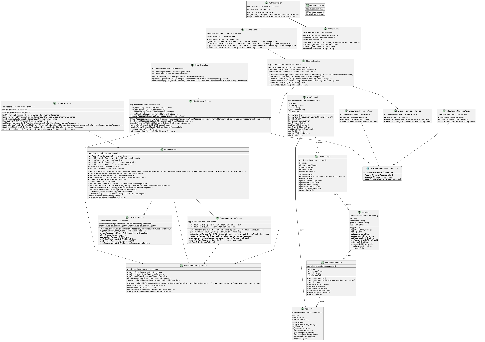

# Dissension

A full-stack chat/community platform built as an OOP-focused project.

The project is split into:
- Backend: Spring Boot REST API + WebSocket features
- Database: PostgreSQL
- Frontend: React + TypeScript + Vite

## Table of Contents

- [Project Overview](#project-overview)
- [Architecture](#architecture)
- [UML Diagram](#uml-diagram)
- [Tech Stack](#tech-stack)
- [Prerequisites](#prerequisites)
- [Setup and Run](#setup-and-run)
- [Useful Commands](#useful-commands)
- [API Documentation](#api-documentation)
- [Project Structure](#project-structure)

## Project Overview

Dissension provides server-based communication spaces with channels and chat capabilities.
The backend handles authentication, authorization, server and channel management, messaging, and realtime communication.
The frontend provides the user interface for authentication, browsing servers/channels, and chat interactions.

## Architecture

- The backend and PostgreSQL run in Docker containers using the root `docker-compose.yml`.
- The frontend runs locally using Vite development server (`npm run dev`).
- Frontend communicates with backend APIs and WebSocket endpoints.

## UML Diagram



## Tech Stack

- Backend: Java, Spring Boot, Spring Data JPA, Spring Security, WebSocket
- Database: PostgreSQL 16
- Frontend: React 19, TypeScript, Vite
- Containerization: Docker, Docker Compose

## Prerequisites

Install the following tools before running the project:

- Docker Desktop (with Docker Compose support)
- Node.js 18+ and npm

## Setup and Run

### 1. Start Backend and Database (Docker)

From the project root, run:

```bash
docker compose up --build -d
```

This starts:
- PostgreSQL on `localhost:5432`
- Backend API on `localhost:8080`

To view logs:

```bash
docker compose logs -f
```

### 2. Start Frontend (Vite)

Open a new terminal, then run:

```bash
cd frontend
npm install
npm run dev
```

Frontend dev server will be available at the URL printed by Vite (typically `http://localhost:5173`).

## Useful Commands

Stop containers:

```bash
docker compose down
```

Stop and remove containers, network, and volumes:

```bash
docker compose down -v
```

Rebuild backend image after backend changes:

```bash
docker compose up --build -d backend
```

## API Documentation

Swagger UI is available at:

`http://localhost:8080/swagger-ui/index.html`

## Project Structure

```text
.
|- backend/            # Spring Boot backend
|- frontend/           # React + TypeScript frontend
|- docker-compose.yml  # Runs backend + PostgreSQL
|- uml-diagram.png     # UML class diagram
```